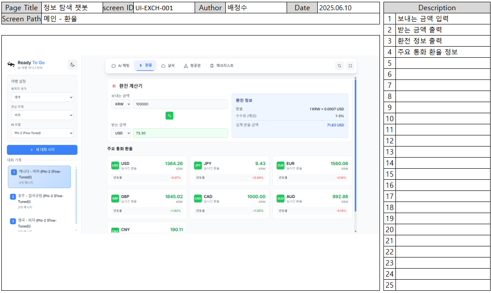

# **Ready To Go**
##   팀소개
> **팀명: Wayfinder**    
- 사용자들이 비자, 보험, 안전 정보 같은 어려운 문제 앞에서 헤매지 않도록 기술과 데이터를 통해 **가장 안전하고 정확한 길을 안내합니다.**  

> **GitHub** 

  <table width="100%">
    <tbody>
      <tr>
        <td align="center" width="33%">
          <a href="https://github.com/Nadaeji">
             
            <strong>나지윤</strong>
          </a>
        </td>
        <td align="center" width="33%">
          <a href="https://github.com/SOOSOO999">
             
            <strong>배정수</strong>
          </a>
        </td>
        <td align="center" width="33%">
          <a href="https://github.com/comet39">
             
            <strong>이혜성</strong>
          </a>
        </td>
      </tr>
    </tbody>
  </table>

---
##   프로젝트 개요

### 🪶 프로젝트명 
> **Ready To Go** 
- 해외 여행자와 이민자를 위한 **AI 기반 정보 탐색 웹 플랫폼**

### 🪶 소개 
- 해외 출국자(여행자, 유학생, 취업자, 이민 준비자 등)가 `비자, 보험, 입국규정, 안전정보`의 실질적인 정보를 쉽고 빠르게 확인할 수 있도록 돕는 **AI 챗봇 서비스**

- GPT 등 범용 언어모델의 한계를 보완하기 위해, `공식문서`를 기반으로 **RAG와 파인튜닝 모델(Phi-2)** 을 활용하여 질문에 대한 정확하고 신뢰할 수 있는 응답 제공

### 🪶 필요성 (현황 및 사용자 Pain Point)
> **높은 출국 수요**
- 대한민국 연평균 출국자 수 **약 60만 명**
- 여행, 유학, 취업, 이민 등 다양한 목적의 출국 → **연간 수십만 건의 정보 탐색 수요**
<table width="100%">
  <tr>
    <td align="center" valign="middle" width="50%">
       
      <small>출국자 (2014~2023)</small>
    </td>
    <td align="center" valign="middle" width="50%">
       
      <small>출국자 (2000~2023)</small>
    </td>
  </tr>
</table>

<a href="https://kosis.kr/statHtml/statHtml.do?sso=ok&returnurl=https%3A%2F%2Fkosis.kr%3A443%2FstatHtml%2FstatHtml.do%3Flist_id%3D%26obj_var_id%3D%26seqNo%3D%26docId%3D0202731021%26tblId%3DDT_1B28025%26vw_cd%3DMT_ZTITLE%26orgId%3D101%26conn_path%3DE1%26markType%3DS%26itm_id%3D%26lang_mode%3Dko%26scrId%3D%26itmNm%3D%EC%A0%84%EA%B5%AD%26">내국인 연간 국제이동, KOSIS</a>

> **정보 접근의 실질적 장벽**
- `정보 분산`: 대사관, 정부기관, 민간기관 등에서 제공하는 문서가 통합되지 않음
- `외국어 문서 중심`: 영어 또는 제3국 언어로 된 문서가 많아 **한국어 사용자에게 진입 장벽**
- `비직관적인 웹사이트 구조`: 여러 탭을 열어가며 직접 해석해야 하고, 단순 번역으로는 맥락 파악이 어려움

> **국제 통계가 말하는 "정보 장벽"**
- **`정부 정책·비자 문제`**: 학생 유치의 중대한 장애 요인

  <table width="100%">
    <tr>
      <td align="center" valign="middle" width="50%">
         
        정부 정책 및 비자 문제 (51%)_2024.11.13
      </td>
      <td align="center" valign="middle" width="50%">
         
        정부 정책 및 비자 문제 (62%)_2025.05.08
      </td>
    </tr>
  </table>

  
    <a href="https://monitor.icef.com/2024/11/new-research-highlights-the-impact-of-policy-on-international-enrolments/?">
      New research highlights the impact of policy on international enrolments, ICEF Monitor
    </a> 
    <a href="https://monitor.icef.com/2025/05/global-survey-underscores-demand-shift-from-big-four-to-big-ten/?">
      Global survey underscores demand shift from “Big Four” to “Big Ten”, ICEF Monitor
    </a>
  

→ 단순한 행정 절차 문제가 아닌, `언어, 문서 해석력, 정보 접근성`이 복합적으로 작용하는 문제

> **LLM 기반 응답의 한계와 개선 필요성**

- `GPT` 등 범용 LLM은 매우 강력하나,  
  일반적으로 **질문에 직접적으로 연결된 문서 기반 정보**보다는 `확률적으로 생성된 일반 지식 응답`에 가까운 경우가 많음  
- 특히 국가별 행정 절차나 실제 서류 기반 정보는 **정확성과 최신성, 문맥 일치**가 중요하나,  
  범용 모델은 이를 보장하지 못하거나, 실제와 다른 내용을 지어내는 `hallucination 현상` 발생가능성  
->   
- ReadyToGo는 단순 API 호출이 아닌,  
  **RAG 기반 문서 검색 + QA 쌍 파인튜닝을 통해 질문에 대한 맥락 기반 응답 정확도를 높이는 모델** 자체 구축
- 이를 통해 사용자는 단순 요약이나 일반 정보가 아닌,  
  **공식 문서 기반의 맞춤형 정답**에 가까운 정보를 얻을 수 있음

---
### 🪶 목표  
> **“검색이 아닌 질문”으로 정보를 얻는 환경 구축**  
- 문서를 직접 찾고 해석하던 방식 → **자연어 질문 + 자동 요약 응답**으로 전환

> **챗봇 + 벡터DB + LLM 결합의 지능형 인터페이스 제공**  
- 사용자의 질문에 맞춰, 벡터DB에서 문서를 검색하고 AI가 핵심만 요약해 응답

> **실질적이고 즉시 활용 가능한 정보 제공**  
- 단순 정보 나열이 아닌, 사용자 상황에 맞춘 **국가별 / 주제별 맞춤 응답** 제공

> **글로벌 활용 가능성**  
- 여행자, 유학생, 취업자, 이민 준비자 모두가 사용할 수 있는 **확장성 있는 플랫폼**

--- 
**Ready To Go**는  
> 세계 곳곳의 복잡한 정보를 **쉽고, 빠르고, 정확하게** 안내해주는  
> "**여행·이민의 길잡이 AI 플랫폼**을 목표"로 함

---
##   데이터 수집
- **카테고리**: 비자 / 보험 / 국가별 여행 안전정보 / 입국절차·규정
- **형태**:
  - 대부분 `.pdf` (공식 대사관·기관 공지문)
  - 여행안전정보: 공공데이터포털 OpenAPI 활용
- **저장 구조**: 국가_문서유형.pdf → 국가/유형 기반 태깅 저장

  <table>
    <tr>
      <td align="center" valign="middle">
         
        <small>데이터 수집 국가 지도</small>
      </td>
    </tr>
  </table>

---
##   기술 스택
### 🪶 Backend

| 항목            | 사용 기술 / 모델명                             | 설명                                                                 |
|----------------|------------------------------------------------|----------------------------------------------------------------------|
| 웹 프레임워크     | Django REST Framework                         | API 서버 및 DB 연동을 위한 백엔드 프레임워크                         |
| 데이터베이스      | MySQL                                          | 사용자, 문서, 메시지 등을 저장하는 관계형 데이터베이스                |
| 벡터 DB        | ChromaDB                                      | 문서 임베딩 저장 및 RAG 기반 검색 수행                               |
| 임베딩 모델      | text-embedding-3-small (OpenAI)                | 문서 내용을 벡터화하는 데 사용되는 경량 임베딩 모델                  |
| 언어 모델       | GPT-3.5-turbo / GPT-4 / Gemini-1.5-flash |  RAG 검색 기반 응답 생성을 위한 대형 언어 모델                        | 
| 파인튜닝 모델    | Phi-2 + QLoRA                                  | QA 쌍 기반 파인튜닝된 경량 언어 모델                                 |
| RAG 구성 도구   | LangChain                                     | 벡터 검색, 문서 필터링 및 응답 흐름 구성 도구                        |

---
### 🪶 Frontend

| 항목            | 사용 기술 / 구성 요소                            | 설명                                                                 |
|----------------|------------------------------------------------|----------------------------------------------------------------------|
| UI 구성        | HTML / Vanilla JavaScript                      | 순수 자바스크립트를 사용한 SPA 방식 웹 프론트엔드 구성               |
| UI 스타일링     | Tailwind CSS                                   | 반응형 및 직관적인 사용자 인터페이스 스타일링                       |

---
### 🪶 배포
| 항목              | 사용 기술 / 환경                     | 설명                                                                 |
|-------------------|--------------------------------------|----------------------------------------------------------------------|
| 서버 호스팅        | AWS EC2                             | 안정적인 클라우드 기반 인프라에서 백엔드 서버 실행       |
| 운영체제(OS)      | Ubuntu                              | EC2 인스턴스에서 사용하는 경량화된 리눅스 기반 운영체제        |
| WSGI 서버         | Gunicorn                            | Django 앱을 실행하기 위한 고성능 WSGI 어플리케이션 서버     |

---
##   주요 기능
| 기능        | 설명                                                    |
| ---------- | ------------------------------------------------------- |
| AI 채팅 시스템 | OpenAI GPT, Google Gemini, Phi-2 Fine-tuned 모델 지원 |
| RAG 기반 정보 검색 | ChromaDB를 활용한 문서 검색 및 컨텍스트 제공          |
| 다국어 지원 | 한국어 ↔ 영어 자동 번역                                    |
| 실시간 정보 | 환율, 날씨, 항공료 정보 제공                               |
| 체크리스트 시스템 | 국가별 준비사항 관리                                 |

---
##   시스템 구성도
### 🪶 시스템 아키텍처

  <table width="100%">
    <tr><td>
      
    </td></tr>
  </table>

---
### 🪶 워크플로우 (채팅 워크플로우 / 모델 파인튜닝 워크플로우)

  <table width="100%">
    <tr>
      <td align="center" valign="middle" width="50%">
         
        채팅 워크플로우
      </td>
      <td align="center" valign="middle" width="50%">
         
        모델 파인튜닝 워크플로우
      </td>
    </tr>
  </table>

---
##  세션관리방식
| 항목       | 방식 / 고려사항 | 설명 |
|-----------|------------------|------|
| 기존 세션 관리 방식 | 자동 생성된 `session_id` 기반 DB 저장 | 사용자가 인증 없이 입장할 경우, 채팅 시, 자동 생성된 ID로 세션 구분으로 대화 유지 |
| 문제점 ① | 새로고침 시 세션 단절 | 브라우저 새로고침 시 session_id 초기화 → 대화 유지 불가 |
| 문제점 ② | 기기 간 대화 연속성 없음 | 로그인 기능이 없기 때문에 같은 사용자가 다른 디바이스에서 대화를 이어갈 수 없음 |
| 개선 방향 | 로그인 시스템 + WebSocket 고려 | 세션 유지와 동기화 기능 강화를 위해 사용자 인증 시스템 및 실시간 연결(WebSocket) 기술 도입 예정 |

---
##   요구사항 정의서

  <table>
    <tr>
      <td align="center" valign="middle">
         
        <small>요구사항 정의서</small>
      </td>
    </tr>
  </table>

---
##   화면설계서

  <table>
    <tr>
      <td align="center" valign="middle">
         
        <small>화면설계서 항목</small>
      </td>
    </tr>
  </table>

 

  <table>
    <tr>
      <td align="center" valign="middle">
         
        <small>기본 페이지</small>
      </td>
    </tr>
  </table>

 

  <table>
    <tr>
      <td align="center" valign="middle">
         
        <small>AI채팅 페이지</small>
      </td>
    </tr>
  </table>

 

  <table>
    <tr>
      <td align="center" valign="middle">
         
        <small>환율 페이지</small>
      </td>
    </tr>
  </table>

 

  <table>
    <tr>
      <td align="center" valign="middle">
         
        <small>날씨 페이지</small>
      </td>
    </tr>
  </table>

 

  <table>
    <tr>
      <td align="center" valign="middle">
         
        <small>항공권 페이지</small>
      </td>
    </tr>
  </table>

 

  <table>
    <tr>
      <td align="center" valign="middle">
         
        <small>체크리스트 페이지</small>
      </td>
    </tr>
  </table>

---
##   WBS

  <table>
    <tr>
      <td align="center" valign="middle">
         
      </td>
    </tr>
  </table>

---
##   테스트 계획 및 결과 보고서

### 🪶 테스트 항목 및 시나리오

| 번호 | 테스트 항목 | 세부 시나리오 | 기대 결과 | 결과 |
|------|-------------|----------------|-------------|------|
| T-01 | 챗봇 초기 로딩 | 페이지 접속 시 마스코트와 기본 안내 표시 | 초기 UI 정상 표시됨 | ✅ |
| T-02 | 국가 선택 기능 | 국가 선택 시 질문에 해당 국가 반영 | 질문 및 응답에서 해당 국가 정보 사용 | ✅ |
| T-03 | 질문 입력 및 전송 | 사용자가 질문 입력 후 전송 | LLM이 응답 생성 및 표시 | ✅ |
| T-04 | 문서 기반 검색 (RAG) | 백엔드에서 적절한 context 추출 | 관련 문서 기반 응답 생성 | ✅ |
| T-05 | 모델 선택 기능 | 모델을 GPT-3.5, GPT-4, Phi-2로 변경 | 선택된 모델로 응답 생성 | ✅ |
| T-06 | 예시 질문 선택 | 예시 질문 클릭 시 자동 전송 | 해당 질문으로 응답 생성 | ✅ |
| T-07 | 에러 처리 | 벡터 DB 경로 누락 시 | 적절한 에러 메시지 출력 | ✅ |
| T-08 | 응답 국가 불일치 문제 | 질문한 국가와 다른 국가 응답 발생 시 | 코드에서 국가 필터 적용으로 해결 | ✅ |
| T-09 | 체크리스트 조회 | 여행 준비 체크리스트 요청 시 | 해당 국가 정보가 표시됨 | ✅ |
| T-10 | 백엔드 서버 다운 시 처리 | 서버 응답 없을 경우 | “서버 연결 실패” 메시지 출력 | ✅ |

---
### 🪶 개선사항 및 조치
> 응답 국가 불일치 문제

  <table width="100%" cellspacing="0" cellpadding="0">
    <tr><td align="center">
      
    </td></tr>
    <tr><td align="center">
      
    </td></tr>
  </table>

- 질문 시 나라가 명시되지 않으면 응답 정확도 떨어짐

 
 

> 응답 국가 불일치 문제 개선 결과

  <table>
    <tr>
      <td align="center" valign="middle">
         
      </td>
    </tr>
  </table>

- message_content가 모델에 쿼리로 입력됨  
- 우리가 선택한 국가와 주제에 대한 내용을 쿼리에 추가되도록 해주어 응답의 일관성 높여줌

---
> 응답 끊김 문제

  <table width="100%" cellspacing="0" cellpadding="0">
    <tr><td align="center">
      
    </td></tr>
    <tr><td align="center">
      
    </td></tr>
  </table>

- 약 20% 확률로 문장이 미완성인 채로 응답이 끝나는 문제 발생
 
 

> 응답 끊김 문제 개선 결과

  <table width="100%" cellspacing="0" cellpadding="0">
    <tr><td align="center">
      
    </td></tr>
    <tr><td align="center">
      
    </td></tr>
  </table>

- 마지막 문장부호, 그리고 미완성 응답일 시 자주 보이는 단어들을 확인하여 `응답을 3번까지 재시도` 하도록 코드 수정   
-> 20번의 테스트 동안 미완성 문장 나오지 않음

---
##   수행결과 (테스트/시연 페이지)
<td align="center" valign="middle">

### 🪶 AI 채팅 시스템
> - OpenAI GPT, Google Gemini, Phi-2 Fine-tuned 모델 지원  
> - RAG 기반 정보 검색: ChromaDB를 활용한 문서 검색 및 컨텍스트 제공  
> - 한국어 ↔ 영어 자동 번역

  <table>
    <tr>
      <td align="center" valign="middle">
         
      </td>
    </tr>
  </table>

### 🪶 실시간 정보
> 날씨, 항공편, 환율 정보 제공

  <table width="100%" cellspacing="0" cellpadding="0">
    <tr><td align="center">
      
    </td></tr>
    <tr><td align="center">
      
    </td></tr>
    <tr><td align="center">
      
  </table>

### 🪶 체크리스트 시스템
> 국가별 준비사항 관리

  <table width="100%" cellspacing="0" cellpadding="0">
    <tr><td align="center">
      
    </td></tr>
    <tr><td align="center">
      
    </td></tr>
  </table>

---
##   사업적 가치
### 🪶 SWOT 분석
| 구분 | 내용 |
| --------------------- | --------------------- |
| **S (Strengths)**     | - **공식 문서 기반 RAG+LLM 시스템** - 번역+요약+질의응답을 한 번에 처리하는 챗봇 UX - 비자·보험·입국·안전정보를 통합 제공하는 구조적 강점 -> 문서 기반 정보를 구조·자동화하여 **기존 검색 서비스와 명확히 차별화**됨  |
| **W (Weaknesses)**    | - 초기 대상 국가 제한(13개국) - 실시간성(항공편/날씨 등)은 외부 API 의존 - 사용자 인증이나 개인화 기능 미도입 -> 데이터 커버리지와 실시간성, 사용자 설정 기능은 향후 개선이 필요한 영역                       |
| **O (Opportunities)**       | - 출국자 60만 명 규모의 안정된 연간 시장 - 유학원/이민 컨설팅 등 B2B 제휴 가능성 - 글로벌 정보 격차 해소에 기여하는 공공가치  -> **디지털 출국 서비스의 빈틈**을 채우는 선점형 솔루션으로, 공공/민간 모두에 진입 가능성 높음 |
| **T (Threats)**       | - 네이버·구글 등 기존 검색/AI 강자의 진입 가능성 - 사용자 기대 수준 대비 LLM 응답 한계 - 해외 정부 정책 변경 시 정보 구조 변경 필요 -> **대형 플랫폼의 기술 진입**과 정보 정책의 변화에 대비한 구조적 유연성 필요     |

---
### 🪶 ReadyToGo의 차별성
| 항목             | 기존 방식                        | ReadyToGo 방식                        |
|------------------|----------------------------------|--------------------------------------|
| 정보 탐색 방식   | 직접 검색, 다중 사이트 이동     | 챗봇 대화 기반 자동 응답              |
| 문서 처리        | 수동 탐색, 다운로드, 수기 정리   | 벡터 DB 기반 문서 자동 분석·검색     |
| 사용자 부담      | 높음                             | 매우 낮음 (질문만 입력하면 됨)         |
| 언어 장벽        | 존재 (원문 외국어 다수)          | 자동 번역 및 한국어 요약 제공         |
| 맞춤형 안내      | 없음                             | 국가/주제별 조건 필터링 + 맞춤 응답   |

---
### 🪶 활용 대상 및 확장성
| 대상군      | 구체 활용 시나리오 |
|-------------|--------------------|
| 일반 여행자 | 출국 전 필수 준비물, 안전 정보, 예방접종 등 챗봇으로 확인 |
| 유학생     | 국가별 학생비자 조건, 건강보험, 입국 절차 등 탐색 |
| 취업자     | 취업비자 요건, 체류 조건, 고용 계약 조건 등 상담 |
| 이민 준비자 | 복수국적, 장기체류, 가족 동반 입국 등 복잡한 사안에 대한 정보 정리 |

---
### 🪶 결론 및 사업 가치 요약
> **ReadyToGo는 단순한 여행정보 서비스가 아닌,  
> “공식 문서 기반 정보 해석을 자동화하는 AI 정보 인터페이스”**

- 연간 **60만 명의 사용자 기반**
- 각종 공공 문서의 정보 격차 해소
- 해외 정보의 **실질적인 이해와 활용을 돕는 AI**
- **챗봇 + 벡터DB + 문서 분석**을 결합한 경쟁력 있는 서비스 모델

→ **공공기관, 교육기관, 글로벌 여행/이민 플랫폼과의 제휴**에서도 강력한 사업적 가치를 가짐을 입증

---
##   한 줄 회고
🪶 나지윤 
> "기획자가 되고 싶다는 목표를 품고 시작한 이번 프로젝트는 단순한 과제 이상이었습니다.
RAG와 LLM을 실제로 구현하면서 기술적 흐름을 이해할 수 있었고, 사업적 가치 분석과 발표를 통해 기획자로서의 시각도 넓힐 수 있었습니다.
특히 사용자 Pain Point를 정의하고, 그것을 해결하는 기능을 기획하는 과정을 통해 ‘기획’이란 일이 얼마나 입체적인지 체감했습니다.
이 모든 과정이 나를 기획자라는 꿈에 한 걸음 더 다가서게 해주었고, 앞으로의 방향에 확신을 심어주었습니다."

🪶 배정수
> "RAG, 파인튜닝, 프론트엔드, 백엔드 개발, 배포에 걸친 전체적인 개발 과정을 진행해 볼 수 있어서 좋은 기회가 되었습니다. 진행 과정 중 배포 단계에서 어려움을 겪었지만 팀원들과 함께 해결해가며 직접 체득할 수 있어서 더욱 의미가 있었습니다."

🪶 이혜성
> "Vanilla JS + Django + ChromaDB + 다중 LLM으로 구성된 복잡한 풀스택 아키텍처를 통합 개발할 수 있는 기회가 돼서 뜻깊은 시간이였습니다. 특히 모델 파인튜닝과 RAG 구현을 통해 AI 엔지니어링 역량을 키울 수 있었습니다."
