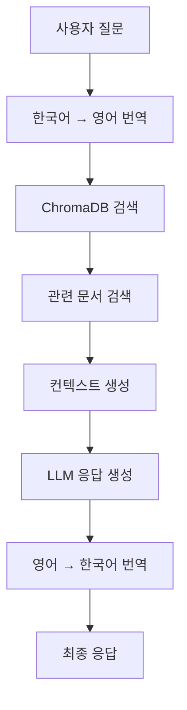

# Ready-To-Go Travel Assistant Backend (Django)

🌍 **AI 기반 여행/이민 정보 채팅 서비스의 Django 백엔드**

## 📋 프로젝트 개요

Ready-To-Go는 여행자와 이민자를 위한 AI 기반 정보 제공 플랫폼입니다. RAG(Retrieval-Augmented Generation) 시스템과 다중 LLM 모델을 활용하여 비자, 보험, 이민 규정, 안전 정보 등에 대한 정확하고 실시간 정보를 제공합니다.

### 주요 기능
- 🤖 **AI 채팅 시스템**: OpenAI GPT, Google Gemini, Phi-2 Fine-tuned 모델 지원
- 🔍 **RAG 기반 정보 검색**: ChromaDB를 활용한 문서 검색 및 컨텍스트 제공
- 🌏 **다국어 지원**: 한국어 ↔ 영어 자동 번역
- 📊 **실시간 정보**: 환율, 날씨, 항공료 정보 제공
- ✅ **체크리스트 시스템**: 국가별 준비사항 관리

## 🏗️ 시스템 아키텍처

```
backend_django/
├── 🔧 config/                    # Django 설정
│   ├── settings.py              # 환경설정 (DB, API키, CORS)
│   ├── urls.py                  # 메인 URL 라우팅
│   ├── wsgi.py                  # WSGI 배포 설정
│   └── asgi.py                  # ASGI 비동기 설정
├── 💽 core/                      # 핵심 모델 및 공통 기능
│   ├── models.py                # 데이터 모델 (Document, Conversation, Message, FAQ, Community)
│   ├── views.py                 # 기본 API (헬스체크, 국가/토픽 목록)
│   ├── management/commands/     # Django 관리 명령어
│   └── migrations/              # 데이터베이스 마이그레이션
├── 💬 chat/                      # AI 채팅 시스템
│   ├── views.py                 # 채팅 로직 (메시지 처리, 대화 관리)
│   └── urls.py                  # 채팅 API 엔드포인트
├── 🤖 ai_services/               # AI 서비스 모듈
│   ├── llm.py                   # 다중 LLM 통합 (OpenAI, Gemini, Phi-2)
│   ├── rag.py                   # RAG 시스템 (ChromaDB + 번역)
│   └── fine_tuning/             # 모델 파인튜닝
│       ├── qa_pair_generator.py # QA 쌍 자동 생성
│       ├── model_trainer.py     # 모델 학습
│       └── *.ipynb              # 실험 노트북
├── 📊 realtime_info/             # 실시간 정보 서비스
│   ├── views.py                 # 환율, 날씨, 항공료 API
│   ├── services.py              # 외부 API 통합
│   └── flight.py                # 항공료 크롤링
├── ✅ checklist/                 # 체크리스트 시스템
├── 👥 community/                 # 커뮤니티 기능
├── 📄 documents/                 # 문서 관리
├── 💾 data/                      # 데이터 저장소
│   └── vectors/                 # ChromaDB 벡터 데이터베이스
├── 📋 requirements.txt           # Python 의존성
├── ⚙️ setup.py                   # 프로젝트 초기 설정
└── 🔐 .env                       # 환경변수 (API 키)
```

## 🚀 시작하기

### 1. 환경 설정

```bash
# Python 가상환경 생성
python -m venv venv

# 가상환경 활성화
# Windows
venv\Scripts\activate
# macOS/Linux  
source venv/bin/activate

# 의존성 설치
pip install -r requirements.txt
```

### 2. 환경변수 설정

`.env` 파일을 생성하고 다음 정보를 입력하세요:

```env
# Django
DJANGO_SECRET_KEY=your-secret-key
DEBUG=True

# Database (MySQL)
DB_NAME=RTG_V2
DB_USER=root
DB_PASSWORD=mysql
DB_HOST=localhost
DB_PORT=3306

# AI Services
OPENAI_API_KEY=your-openai-api-key
GOOGLE_API_KEY=your-google-api-key
GPU_AI_SERVER_URL=https://your-gpu-server.ngrok-free.app

# Real-time APIs
FIXER_API_KEY=your-fixer-api-key
OPENWEATHER_API_KEY=your-openweather-api-key

# Vector DB
VECTOR_DB_PATH=/path/to/backend_django/data/vectors
```

### 3. 데이터베이스 설정

```bash
# MySQL 설치 및 데이터베이스 생성
mysql -u root -p
CREATE DATABASE RTG_V2 CHARACTER SET utf8mb4 COLLATE utf8mb4_unicode_ci;

# Django 마이그레이션
python manage.py makemigrations
python manage.py migrate

# 관리자 계정 생성
python manage.py createsuperuser
```

### 4. 서버 실행

```bash
python manage.py runserver
```

서버는 `http://localhost:8000`에서 실행됩니다.

## 📡 API 엔드포인트

### 기본 정보

| Method | Endpoint | 설명 | 응답 |
|--------|----------|------|------|
| GET | `/api/` | 앱 정보 | 버전, 상태 정보 |
| GET | `/api/health/` | 헬스 체크 | 서버 상태 확인 |
| GET | `/api/countries/` | 지원 국가 목록 | 20개국 정보 |
| GET | `/api/topics/` | 주제 목록 | visa, insurance, safety, immigration |
| GET | `/api/sources/` | 문서 출처 | 정부/대사관 URL |

### 채팅 시스템

| Method | Endpoint | 설명 | 요청 데이터 |
|--------|----------|------|------------|
| POST | `/api/chat/conversation/` | 새 대화 세션 생성 | `session_id`, `country_id`, `topic_id` |
| POST | `/api/chat/message/` | 메시지 전송 | `message`, `conversation_id`, `model_id` |
| GET | `/api/chat/history/<id>/` | 대화 기록 조회 | - |
| GET | `/api/chat/examples/` | 예시 질문 | `country`, `topic` (쿼리 파라미터) |
| GET | `/api/chat/sources/` | 문서 출처 | `country`, `topic` (쿼리 파라미터) |
| GET | `/api/chat/settings/models/` | 사용 가능한 모델 | - |

### 실시간 정보

| Method | Endpoint | 설명 | 파라미터 |
|--------|----------|------|----------|
| GET | `/api/realtime/exchange/` | 환율 정보 | `base`, `targets` |
| GET | `/api/realtime/weather/` | 날씨 정보 | `country`, `city` |
| GET | `/api/realtime/flight-trends/` | 항공료 정보 | `origin`, `destination`, `date` |

### 체크리스트 & 커뮤니티

| Method | Endpoint | 설명 | 파라미터 |
|--------|----------|------|----------|
| GET | `/api/checklist/` | 체크리스트 조회 | `country` |
| GET | `/api/community/posts/` | 게시글 목록 | `type`, `country`, `topic`, `page` |
| POST | `/api/community/posts/` | 게시글 작성 | `title`, `content`, `post_type` |
| POST | `/api/community/posts/<id>/comments/` | 댓글 작성 | `content`, `parent_id` |
| POST | `/api/community/like/` | 좋아요 토글 | `post_id` 또는 `comment_id` |

## 🤖 AI 서비스 아키텍처

### LLM 모델 지원

```python
# 지원 모델
models = [
    "gpt-3.5-turbo",      # OpenAI GPT-3.5
    "gpt-4",              # OpenAI GPT-4  
    "gemini-1.5-flash",   # Google Gemini
    "phi-2"               # Fine-tuned Phi-2 (GPU 서버)
]

# 폴백 체인
Primary Model → Fallback Model → Error Handling
```

### 데이터 워크플로우



### 데이터베이스 모델

```python
# 핵심 모델
class Document(BaseModel):
    title = CharField(max_length=500)
    url = URLField()
    country = CharField(max_length=100, db_index=True)
    topic = CharField(max_length=100, db_index=True)
    source = CharField(max_length=200)

class Conversation(BaseModel):
    session_id = CharField(max_length=100, db_index=True)
    country = CharField(max_length=100)
    topic = CharField(max_length=100)

class Message(BaseModel):
    conversation = ForeignKey(Conversation)
    role = CharField(max_length=20)  # user, assistant
    content = TextField()
    references = TextField()  # JSON 형태의 RAG 참조
```

## 🔧 고급 기능

### 1. Fine-tuning 시스템

```bash
# QA 쌍 생성
cd ai_services/fine_tuning/
python qa_pair_generator.py

# 모델 학습
python model_trainer.py

# 추론 테스트
jupyter notebook inf_test.ipynb
```

### 2. 문서 자동 인덱싱

```bash
# PDF 문서 일괄 처리
python manage.py index_pdfs --pdf_dir /path/to/pdfs

# 개별 문서 추가
python manage.py index_pdfs --single_file document.pdf
```

### 3. 실시간 데이터 수집

```python
# 환율 정보 (Fixer API)
GET /api/realtime/exchange/?base=KRW&targets=USD,EUR,JPY

# 날씨 정보 (OpenWeather API)  
GET /api/realtime/weather/?country=japan&city=tokyo

# 항공료 트렌드 (웹 크롤링)
GET /api/realtime/flight-trends/?origin=ICN&destination=NRT&date=20250618
```

## 🚀 배포


## 🆘 문제 해결

### 자주 발생하는 문제

1. **phi-2 모델 사용**
   
   1.1. colab에서  ```inf_test.py``` 기동
   
   1.2. ```GPU_AI_SERVER_URL``` 수정

2. **OpenAI API 한도 초과**
   
   폴백 모델 선정하여 문제 해결
   

3. **ChromaDB 벡터 검색 오류**
   
    ```VECTOR_DB_PATH``` 확인

---

**Ready-To-Go Team** | 📧 contact@readytogo.ai | 🌐 http://3.36.158.127:8080/
